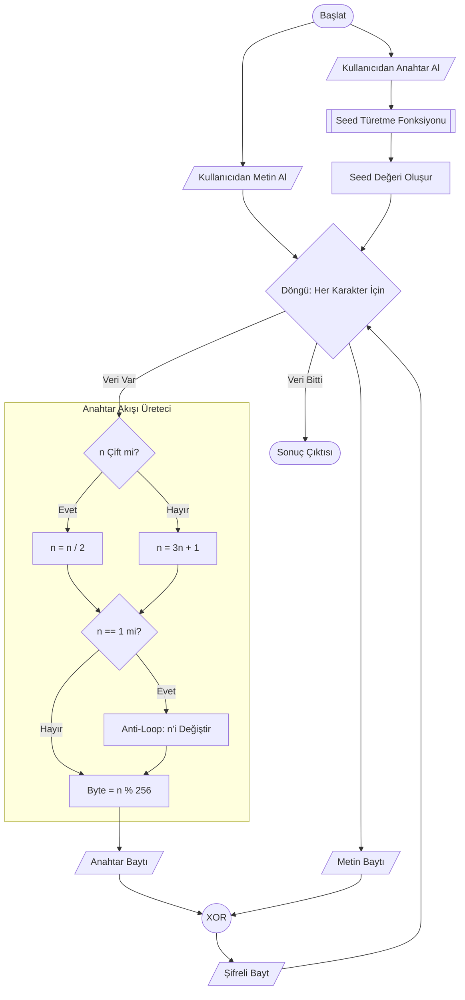

# Collatz Şifreleme Algoritması - Akış Şeması

Bu belge, algoritmanın çalışma mantığını Mermaid diyagramı ile görselleştirir.

## Açıklamalar
1. **Seed Türetme**: String anahtar, matematiksel işlemlerle bir başlangıç sayısına (seed) dönüştürülür.
2. **Collatz Döngüsü**: Seed üzerinden Collatz kuralları uygulanarak sayı sürekli değişir. Her adımda yeni bir sayı üretilir.
3. **XOR İşlemi**: Üretilen sayının mod 256'sı (anahtar baytı) ile metin karakterinin ASCII değeri (metin baytı) XOR'lanarak şifreli veri elde edilir.
